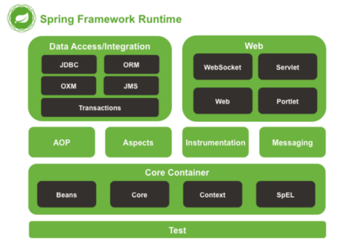
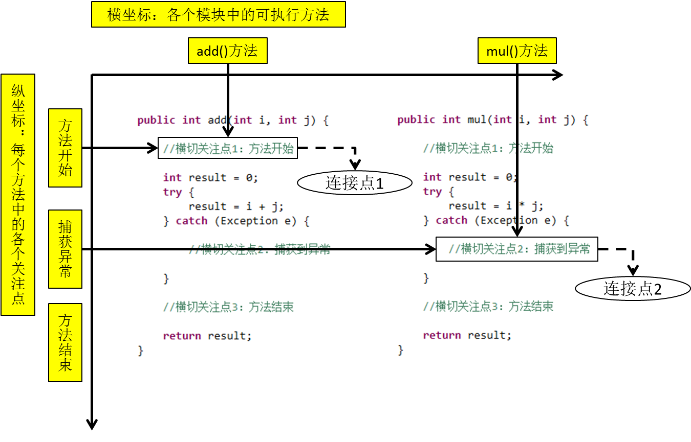
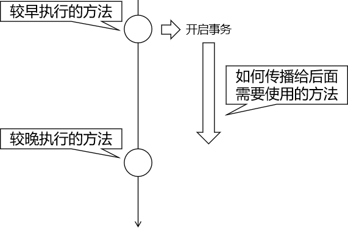
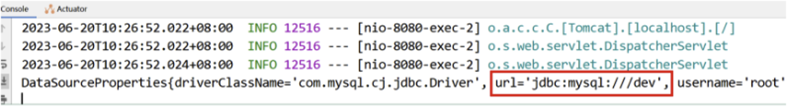

广义上的 Spring 泛指以 `Spring Framework` 为基础的 Spring 技术栈。

Spring是一个由多个不同子项目（模块）组成的成熟技术，其包含了例如`Spring Framework`、`Spring MVC`、`SpringBoot`、`Spring Cloud`、`Spring Data`、`Spring Security` 等，其中 Spring Framework 是其他子项目的基础。

# SpringFramework

Spring Framework（Spring框架）即是Spring技术栈的基础，Spring的其他框架均以 `SpringFramework` 框架为基础。


框架结构图：




| 功能模块       | 功能介绍                                                    |
| -------------- | ----------------------------------------------------------- |
| Core Container | 核心容器，在 Spring 环境下使用任何功能都必须基于 IOC 容器。 |
| AOP&Aspects    | 面向切面编程                                                |
| TX             | 声明式事务管理。                                            |
| Spring MVC     | 提供了面向Web应用程序的集成功能。                           |

# SpringIoC

## Spring IoC 容器和核心概念

### 组件和组件管理

根据MVC的架构设计，每一层实际上就是一个组件，例如：控制层组件、业务逻辑层组件、持久化层组件。


通过Spring框架，可以由其统一管理，其作用例如：

- -组件对象实例化

- 组件属性属性赋值
- 组件对象之间引用
- 组件对象存活周期管理
- ......


需要注意的是：组件是映射到应用程序中所有可重用组件的Java对象，应该是可复用的功能对象。

即：**组件一定是对象，对象不一定是组件。**


综上所述，Spring就充当了组件容器，创建、管理、存储组件。

### Spring IoC 容器和容器实现

#### 简单容器和复杂容器

对于容器这个概念：其分为简单容器和复杂容器。

所谓简单容器就例如：数组，List集合，Set集合等。

而复杂容器，就例如Servlet，其可以管理内部组件（Servlet、Filter、Listener）的一生。

`SpringIoC` 容器也是一个复杂容器。它们不仅要负责创建组件的对象、存储组件的对象，还要负责调用组件的方法让它们工作，最终在特定情况下销毁组件。

#### Spring IoC 容器

Spring IoC 容器，负责实例化、配置和组装 bean（组件）。容器通过读取配置元数据来获取有关要实例化、配置和组装组件的指令。配置元数据以 XML、Java 注解或 Java 代码形式表现。它允许表达组成应用程序的组件以及这些组件之间丰富的相互依赖关系。

#### 容器接口以及实现类

##### Spring IoC 容器接口

`BeanFactory` 接口提供了一种高级配置机制，能够管理任何类型的对象，它是Spring IoC 容器标准化超接口。

`ApplicationContext` 是 `BeanFactory` 的子接口。它扩展了以下功能：

- 更容易与 Spring 的 AOP 功能集成
- 消息资源处理（用于国际化）
- 特定于应用程序给予此接口实现，例如Web 应用程序的 `WebApplicationContext`

简而言之， `BeanFactory` 提供了配置框架和基本功能，而 `ApplicationContext` 添加了更多特定于企业的功能。 `ApplicationContext` 是 `BeanFactory` 的完整超集。

##### ApplicationContext容器实现类

| 类型名                             | 简介                                                         |
| ---------------------------------- | ------------------------------------------------------------ |
| ClassPathXmlApplicationContext     | 通过读取类路径下的 XML 格式的配置文件创建 IOC 容器对象       |
| FileSystemXmlApplicationContext    | 通过文件系统路径读取 XML 格式的配置文件创建 IOC 容器对象     |
| AnnotationConfigApplicationContext | 通过读取Java配置类创建 IOC 容器对象                          |
| WebApplicationContext              | 专门为 Web 应用准备，基于 Web 环境创建 IOC 容器对象，并将对象引入存入 ServletContext 域中。 |

#### 容器管理配置方式

Spring框架提供了多种配置方式：XML配置方式、注解方式和Java配置类方式

1. XML配置方式：是Spring框架最早的配置方式之一，通过在XML文件中定义Bean及其依赖关系、Bean的作用域等信息，让Spring IoC 容器来管理Bean之间的依赖关系。该方式从Spring框架的第一版开始提供支持。
2. 注解方式：从Spring 2.5版本开始提供支持，可以通过在Bean类上使用注解来代替XML配置文件中的配置信息。通过在Bean类上加上相应的注解（如@Component, @Service, @Autowired等），将Bean注册到Spring IoC容器中，这样Spring IoC容器就可以管理这些Bean之间的依赖关系。
3. **Java配置类**方式：从Spring 3.0版本开始提供支持，通过Java类来定义Bean、Bean之间的依赖关系和配置信息，从而代替XML配置文件的方式。Java配置类是一种使用Java编写配置信息的方式，通过@Configuration、@Bean等注解来实现Bean和依赖关系的配置。 

### Spring IoC / DI

#### **IoC（Inversion of Control）控制反转**

IoC 主要是针对对象的创建和调用控制而言的，也就是说，当应用程序需要使用一个对象时，不再是应用程序直接创建该对象，而是由 IoC 容器来创建和管理，即控制权由应用程序转移到 IoC 容器中，也就是“反转”了控制权。这种方式基本上是通过依赖查找的方式来实现的，即 IoC 容器维护着构成应用程序的对象，并负责创建这些对象。

#### **DI (Dependency Injection) 依赖注入**

DI 是指在组件之间传递依赖关系的过程中，将依赖关系在容器内部进行处理，这样就不必在应用程序代码中硬编码对象之间的依赖关系，实现了对象之间的解耦合。在 Spring 中，DI 是通过 XML 配置文件或注解的方式实现的。它提供了三种形式的依赖注入：构造函数注入、Setter 方法注入和接口注入。

## Spring IoC 实践和应用

### SpringIoC / DI 实现步骤

1. 配置元数据（配置）：即编写交给Spring IoC容器管理组件的信息。例如：

   ```xml
   <?xml version="1.0" encoding="UTF-8"?>
   <!-- 此处要添加一些约束，配置文件的标签并不是随意命名 -->
   <beans xmlns="http://www.springframework.org/schema/beans"
     xmlns:xsi="http://www.w3.org/2001/XMLSchema-instance"
     xsi:schemaLocation="http://www.springframework.org/schema/beans
       https://www.springframework.org/schema/beans/spring-beans.xsd">
   
     <bean id="..." [1] class="..." [2]>  
       <!-- collaborators and configuration for this bean go here -->
     </bean>
   
     <bean id="..." class="...">
       <!-- collaborators and configuration for this bean go here -->
     </bean>
     <!-- more bean definitions go here -->
   </beans>
   ```

2. 实例化 IoC 容器：提供给 `ApplicationContext` 构造函数的位置路径是资源字符串地址，允许容器从各种外部资源（如本地文件系统、Java CLASSPATH 等）加载配置元数据。例如：

   ```java
   //实例化ioc容器,读取外部配置文件,最终会在容器内进行ioc和di动作
   ApplicationContext context = 
              new ClassPathXmlApplicationContext("services.xml", "daos.xml");
   ```

3. 获取Bean（组件）：`ApplicationContext` 是一个高级工厂的接口，能够维护不同 bean 及其依赖项的注册表。通过使用方法        `T getBean(String name, Class requiredType)` ，可以检索 bean 的实例。例如：

   ```java
   //创建ioc容器对象，指定配置文件，ioc也开始实例组件对象
   ApplicationContext context = new ClassPathXmlApplicationContext("services.xml", "daos.xml");
   //获取ioc容器的组件对象
   PetStoreService service = context.getBean("petStore", PetStoreService.class);
   //使用组件对象
   List<String> userList = service.getUsernameList();
   ```

### 基于XML配置方式管理组件

#### 组件信息声明配置(IoC)

##### 基于无参数构造函数

直接声明即可

```xml
<bean id="happyComponent" class="com.qingmuy.ioc.HappyComponent"/>
```

- bean标签：通过配置bean标签告诉IOC容器需要创建对象的组件信息
- id属性：bean的唯一标识,方便后期获取Bean！
- class属性：组件类的全限定符！
- 注意：**要求当前组件类必须包含无参数构造函数**


##### 基于静态工厂方法实例化

需要额外声明静态工厂方法。

```xml
<bean id="clientService"
  class="examples.ClientService"
  factory-method="createInstance"/>
```

- class属性：指定工厂类的全限定符！
- factory-method: 指定静态工厂方法，**该方法必须是static方法**。


##### 基于实例工厂方法实例化

先声明配置工厂类的组件信息，再通过指定非静态工厂对象和方法名来配置生成的ioc信息。

```XML
<!-- 将工厂类进行ioc配置 -->
<bean id="serviceLocator" class="examples.DefaultServiceLocator">
</bean>

<!-- 根据工厂对象的实例工厂方法进行实例化组件对象 -->
<bean id="clientService"
  factory-bean="serviceLocator"
  factory-method="createClientServiceInstance"/>
```

- factory-bean属性：指定当前容器中工厂Bean 的名称。
- factory-method:  指定实例工厂方法名。**实例方法必须是非static的**。

#### 组件依赖注入配置 (DI)

可以理解为在Spring配置文件中新建对象并且声明，便于Spring统一管理。

##### 基于构造函数的依赖注入(单个构造参数)

用例：

组件类如下：

```java
// 被引用组件类
public class UserDao {
}

// 组件类	单参数
public class UserService {
    
    private UserDao userDao;

    public UserService(UserDao userDao) {
        this.userDao = userDao;
    }
}
```

xml配置文件声明如下：

```xml
<!-- 引用和被引用的组件  必须全部在IoC容器 -->
<!-- 被引用类bean声明 -->
<bean id="userDao" class="com.qingmuy.ioc_02.UserDao" />

<!-- 引入类bean声明 -->
<bean id="userService" class="com.qingmuy.ioc_02.UserService" >
    <!-- 构造参数传值 DI的配置
        <constructor-arg    构造参数的 di配置
            value   = 直接属性值 String name = "张三" int age = "18"
            ref     = 引用其他的bean beanID值
    -->
    <!-- 构造函数引用 -->
    <constructor-arg ref="userDao" />
</bean>
```

注意：

1. 如果调用了其他bean类，需要声明其他bean类
2. 被调用的bean类的顺序和bean类的顺序没有前后关系，只要声明即可
3. `constructor-arg`标签的两个属性值`value`和`ref`二选一
   1. value：直接赋值
   2. ref：引用其他bean类


##### 基于构造函数的依赖注入(多构造参数)

用例：

组件类如下：

```java
// 被引用组件类
public class UserDao {
}

// 组件类	包含多个参数
public class UserService {
    
    private UserDao userDao;
    
    private int age;
    
    private String name;

    public UserService(int age , String name ,UserDao userDao) {
        this.userDao = userDao;
        this.age = age;
        this.name = name;
    }
}
```

xml配置文件声明如下：

```xml
<!-- 2.多个构造参数注入 -->
<bean id="userService1" class="com.qingmuy.ioc_02.UserService" >
    <!-- 方案1：构造参数的顺序填写值 value 直接赋值 ref 引用其他的beanid-->
    <constructor-arg value="18" />
    <constructor-arg value="张三" />
    <constructor-arg ref="userDao" />
</bean>

<bean id="userService2" class="com.qingmuy.ioc_02.UserService" >
    <!-- 方案2：构造参数的名称填写，不用考虑顺序 name = 构造参数的名字 [经常使用]-->
    <constructor-arg name="name" value="张三" />
    <constructor-arg name="age" value="18" />
    <constructor-arg name="userDao" ref="userDao" />
</bean>

<bean id="userService3" class="com.qingmuy.ioc_02.UserService" >
    <!-- 方案3：构造参数的参数的下角标指定填写，不用考虑顺序 index = 构造参数的下角标 从左到右 从0开始 [经常使用] -->
    <constructor-arg index="0" value="18" />
    <constructor-arg index="1" value="张三" />
    <constructor-arg index="2" ref="userDao" />
</bean>
```

注意：

多参数注入时，需要对多个参数分别进行注明，三个方法：

1. 按照组件类里的顺序进行赋值或引用
2. 提前声明name参数，即属性值
3. 提前声明下角标：即在组件类里的顺序，顺序从左到右，从0开始。


##### 基于Setter方法依赖注入

最常用的方法

用例：

组件类如下：

```java
// 被引用组件类
public Class MovieFinder{

}

// 组件类	内含setter方法
public class SimpleMovieLister {

  private MovieFinder movieFinder;
  
  private String movieName;

  public void setMovieFinder(MovieFinder movieFinder) {
    this.movieFinder = movieFinder;
  }
  
  public void setMovieName(String movieName){
    this.movieName = movieName;
  }

  // business logic that actually uses the injected MovieFinder is omitted...
}
```

xml配置文件声明如下：

```xml
<!-- 触发setter方法进行注入 -->
<bean id="movieFinder" class="com.qingmuy.ioc_02.MovieFinder" />

<bean id="simpleMovieLister" class="com.qingmuy.ioc_02.SimpleMovieLister" >
    <!--
        name -> 属性名 setter 方法的 去set和首字母小写的值  调用set方法的名
            命名规则用例：setMovieFinder -> movieFinder
        value | ref  二选一    value = 赋值  ref = 其他bean的Id
    -->
    <property name="movieFinder" ref="movieFinder" />
    <property name="movieName" value="让子弹飞" />
</bean>
```

注意：

1. 组件内部需要含有setter方法
2. 对于setter方法使用`property`标签给setter方法对应的属性赋值
3. name属性代表set方法标识、ref代表引用bean的标识id、value属性代表基本属性值
4. `proprety`标签的`name`属性必须为该属性名 setter 方法的 去“set"后将首字母小写的值

#### IoC容器创建与使用

容器实例化的两种方法：

```java
//方式1:实例化并且指定配置文件
//参数：String...locations 传入一个或者多个配置文件
ApplicationContext context = new ClassPathXmlApplicationContext("services.xml", "daos.xml");

//方式2:先实例化，再指定配置文件，最后刷新容器触发Bean实例化动作 [springmvc源码和contextLoadListener源码方式]
ClassPathXmlApplicationContext context1 = new ClassPathXmlApplicationContext();
//设置配置配置文件,方法参数为可变参数,可以设置一个或者多个配置
context1.setConfigLocations("spring-03.xml");
//后配置的文件,需要调用refresh方法,触发刷新配置
context1.refresh();
```

Bean对象获取：

```java
//方式1: 根据id获取
//没有指定类型,返回为Object,需要类型转化!
HappyComponent happyComponent = (HappyComponent) context.getBean("happyComponent");

//使用组件对象
happyComponent.doWork();


//方式2: 根据类型获取
//根据类型获取,但是要求,同类型(当前类,或者之类,或者接口的实现类)只能有一个对象交给IoC容器管理
//配置两个或者以上出现: org.springframework.beans.factory.NoUniqueBeanDefinitionException 问题
HappyComponent happyComponent1 = context.getBean(HappyComponent.class);
happyComponent1.doWork();


//方式3: 根据id和类型获取
HappyComponent happyComponent2 = context.getBean("happyComponent", HappyComponent.class);
happyComponent2.doWork();

//根据类型来获取bean时，在满足bean唯一性的前提下，其实只是看：『对象 instanceof 指定的类型』的返回结果，
//只要返回的是true就可以认定为和类型匹配，能够获取到。
```

#### 组件作用域和周期方法配置

可以在组件类中定义方法，当IoC容器实例化或者销毁组件对象的时候进行调用，这两个方法就是生命周期方法。

类似于Servlet中的init/destroy方法，可以在周期方法完成初始化和释放资源。

##### 周期方法配置

组件类

```java
public class BeanOne {

  //周期方法要求： 方法命名随意，但是要求方法必须是 public void 无形参列表
  public void init() {
    // 初始化逻辑
  }
}

public class BeanTwo {

  public void cleanup() {
    // 释放资源逻辑
  }
}
```

周期方法配置

```java
<beans>
  <bean id="beanOne" class="examples.BeanOne" init-method="init" />
  <bean id="beanTwo" class="examples.BeanTwo" destroy-method="cleanup" />
</beans>
```

##### 作用域配置

`<bean` 标签声明Bean，只是将Bean的信息配置给SpringIoC容器！

在IoC容器中，这些`<bean`标签对应的信息转成Spring内部 `BeanDefinition` 对象，`BeanDefinition` 对象内，包含定义的信息（id,class,属性等等）！

这意味着，`BeanDefinition`与`类`概念一样，SpringIoC容器可以可以根据`BeanDefinition`对象反射创建多个Bean对象实例。

具体创建多少个Bean的实例对象，由Bean的作用域Scope属性指定！

| 取值      | 含义                                        | 创建对象的时机   | 默认值 |
| --------- | ------------------------------------------- | ---------------- | ------ |
| singleton | 在 IOC 容器中，这个 bean 的对象始终为单实例 | IOC 容器初始化时 | 是     |
| prototype | 这个 bean 在 IOC 容器中有多个实例           | 获取 bean 时     | 否     |

XML配置文件声明：

```xml
<!-- 声明范围，若为单例则为"prototype"，若为多例则为"singleton"-->
<bean id="javabean2" class="com.qingmuy.ioc_04.Javabean2" scope="singleton" />
<bean id="javabean3" class="com.qingmuy.ioc_04.Javabean2" scope="prototype" />
```

测试类：

```java
public void test_04_scope(){
    ClassPathXmlApplicationContext applicationContext = new ClassPathXmlApplicationContext("spring-04.xml");

    Javabean2 javabean0 = applicationContext.getBean("javabean2", Javabean2.class);
    Javabean2 javabean1 = applicationContext.getBean("javabean2", Javabean2.class);
    System.out.println(javabean0 == javabean1);

    Javabean2 javabean2 = applicationContext.getBean("javabean3", Javabean2.class);
    Javabean2 javabean3 = applicationContext.getBean("javabean3", Javabean2.class);
    System.out.println(javabean2 == javabean3);

    applicationContext.close();
}
```

最终输出结果为：

```java
true
false
```

#### FactoryBean特性和使用

`FactoryBean` 接口是Spring IoC容器实例化逻辑的可插拔性点。

用于配置复杂的Bean对象，可以将创建过程存储在`FactoryBean` 的getObject方法。

`FactoryBean<T>` 接口提供三种方法：

- `T getObject()`: 

    返回此工厂创建的对象的实例。该返回值会被存储到IoC容器！
- `boolean isSingleton()`: 

    如果此 `FactoryBean` 返回单例，则返回 `true` ，否则返回 `false` 。此方法的默认实现返回 `true` （注意，lombok插件使用，可能影响效果）。
- `Class<?> getObjectType()`: 返回 `getObject()` 方法返回的对象类型，如果事先不知道类型，则返回 `null` 。


个人理解：

对于一些复杂的对象的创建，需要使用到工厂设计模式。

所谓工厂设计模式，就是对于创建复杂对象时的桥接，该桥接即为接口，接口内包含了三个方法：`创建复杂对象的方法`、`返回值类型的方法`、`返回单例多例的方法`。

该接口需要继承`FactoryBean`接口；其内部的单例多例的方法被默认设置为单例，可以不用重写。

需要注意的点：

- XML配置文件配置FactoryBean接口时，实际上配置了两个类：目标类(复杂对象)和接口类；而接口类的id实际上就是配置的id前缀`&`。

- 若想通过XML配置文件实现对复杂对象的操作，需要对接口类添加中间变量。
- 接口类默认返回单例。

 

下面演示`FactoryBean`的使用

复杂对象的实现：

```java
public class javabean {
    private String name;

    public String getName() {
        return name;
    }

    public void setName(String name) {
        this.name = name;
    }
}
```

FactoryBean接口的实现：

```java
public class javabeanFactorybean implements FactoryBean<javabean> {
    //此处valueOfName变量的设置是为了方便给复杂对象进行赋值；可以理解为通过本中间变量实现操作FactoryBean对象即可完成对复杂对象的赋值。
    private String valueOfName;

    public void setValueOfName(String valueOfName) {
        this.valueOfName = valueOfName;
    }

    @Override
    public javabean getObject() throws Exception {
        javabean javabean = new javabean();
        //赋值操作
        javabean.setName(valueOfName);
        return javabean;
    }

    @Override
    public Class<?> getObjectType() {
        return javabean.class;
    }
}
```

XML配置文件的实现：

```xml
<bean id="javabean" class="com.qingmuy.IoC_05.javabeanFactorybean" >
    <!-- 此处标签的作用是声明FactoryBean类的配置，name需要和变量保持一致，value即为赋值 -->
    <property name="valueOfName" value="张三" />
</bean>
```

测试类的实现：

```java
@Test
public void test_05(){
    ClassPathXmlApplicationContext applicationContext = new ClassPathXmlApplicationContext("spring-05.xml");

    javabean javabean = applicationContext.getBean("javabean", javabean.class);
    //直观的展现出Spring对对象的管理
    System.out.println(javabean.getName());

    applicationContext.close();
}
```

### 基于注解方式管理组件

#### Bean注解标记和扫描(IoC)

和 XML 配置文件一样，注解本身并不能执行，注解本身仅仅只是做一个标记，具体的功能是框架检测到注解标记的位置，然后针对这个位置按照注解标记的功能来执行具体操作。

本质上：所有一切的操作都是 Java 代码来完成的，XML 和注解只是告诉框架中的 Java 代码如何执行。

组件类准备：

**普通组件**

```java
public class CommonComponent {
}
```

**Controller组件**

```Java
public class XxxController {
}
```

**Service组件**

```Java
public class XxxService {
}
```

**Dao组件**

```Java
public class XxxDao {
}
```


##### **组件添加标记**

| 注解        | 说明                                                         |
| ----------- | ------------------------------------------------------------ |
| @Component  | 该注解用于描述 Spring 中的 Bean，它是一个泛化的概念，仅仅表示容器中的一个组件（Bean），并且可以作用在应用的任何层次，例如 Service 层、Dao 层等。 使用时只需将该注解标注在相应类上即可。 |
| @Repository | 该注解用于将数据访问层（Dao 层）的类标识为 Spring 中的 Bean，其功能与 @Component 相同。 |
| @Service    | 该注解通常作用在业务层（Service 层），用于将业务层的类标识为 Spring 中的 Bean，其功能与 @Component 相同。 |
| @Controller | 该注解通常作用在控制层（如SpringMVC 的 Controller），用于将控制层的类标识为 Spring 中的 Bean，其功能与 @Component 相同。 |

通过查看源码得知，@Controller、@Service、@Repository这三个注解只是在@Component注解的基础上起了三个新的名字。

对于Spring使用IOC容器管理这些组件来说没有区别，也就是语法层面没有区别。所以@Controller、@Service、@Repository这三个注解只是给开发人员看的，便于分辨组件的作用。

注意：虽然它们本质上一样，但是为了代码的可读性、程序结构严谨。不能随便胡乱标记。


**使用注解标记**

普通组件

```Java
@Component
public class CommonComponent {
}
```

Controller组件

```Java
@Controller
public class XxxController {
}
```

Service组件

```Java
@Service
public class XxxService {
}
```

Dao组件

```Java
@Repository
public class XxxDao {
}
```


##### 配置文件确定扫描范围

基本扫描配置

```xml
<!-- 配置自动扫描的包 -->
<!-- 1.包要精准,提高性能!
     2.会扫描指定的包和子包内容
     3.多个包可以使用,分割
-->
<context:component-scan base-package="com.qingmuy.components"/>
```

指定排除组件

```xml
<!-- 指定不扫描的组件 -->
<context:component-scan base-package="com.qingmuy.components">
    
    <!-- context:exclude-filter标签：指定排除规则 -->
    <!-- type属性：指定根据什么来进行排除，annotation取值表示根据注解来排除 -->
    <!-- expression属性：指定排除规则的表达式，对于注解来说指定全类名即可 -->
    <context:exclude-filter type="annotation" expression="org.springframework.stereotype.Controller"/>
</context:component-scan>
```

指定扫描组件

```xml
<!-- 仅扫描指定的组件 -->
<!-- 仅扫描 = 关闭默认规则 + 追加规则 -->
<!-- use-default-filters属性：取值false表示关闭默认扫描规则 -->
<context:component-scan base-package="com.qingmuy.ioc.components" use-default-filters="false">
    
    <!-- context:include-filter标签：指定在原有扫描规则的基础上追加的规则 -->
    <context:include-filter type="annotation" expression="org.springframework.stereotype.Controller"/>
</context:component-scan>
```


##### 组件BeanName

配置XML时，可以通过id属性指定组件的名字：便于在其他的地方引用。使用注解仍然有一个唯一表示。

默认情况：雷鸣的首字母小写就是Bean的id。例如StudentDao类对应的bean的id就是studentDao。

使用value属性指定：

```java
@Controller(value = "tianDog")
public class SoldierController {
}
```

当注解中只设置一个属性时，value属性的属性名可以省略：

```Java
@Service("smallDog")
public class SoldierService {
}
```


#### Bean作用域和周期方法注解

**周期方法**

通过在组件类中自定义方法并添加注解的方法可以实现周期方法，在IoC容器实例化或销毁对象时进行调用。

```java
@Component
public class JavaBean {
    // 周期方法命名随意，但是要求方法必须是 public void 无形参列表
    @PostConstruct		//初始化方法注解
    public void init(){
        System.out.println("JavaBean.Init");
    }

    @PreDestroy		//销毁方法注解
    public void destory(){
        System.out.println("JavaBean.destory");
    }
}
```

**Bean类作用域**

`<bean` 标签声明Bean，只是将Bean的信息配置给SpringIoC容器！

在IoC容器中，这些`<bean`标签对应的信息转成Spring内部 `BeanDefinition` 对象，`BeanDefinition` 对象内，包含定义的信息（id,class,属性等等）！

这意味着，`BeanDefinition`与`类`概念一样，SpringIoC容器可以可以根据`BeanDefinition`对象反射创建多个Bean对象实例。

具体创建多少个Bean的实例对象，由Bean的作用域Scope属性指定！

*作用域的可选值*

| 取值      | 含义                                        | 创建对象的时机   | 默认值 |
| --------- | ------------------------------------------- | ---------------- | ------ |
| singleton | 在 IOC 容器中，这个 bean 的对象始终为单实例 | IOC 容器初始化时 | 是     |
| prototype | 这个 bean 在 IOC 容器中有多个实例           | 获取 bean 时     | 否     |

如果是在WebApplicationContext环境下还会有另外两个作用域（但不常用）：

| 取值    | 含义                 | 创建对象的时机 | 默认值 |
| ------- | -------------------- | -------------- | ------ |
| request | 请求范围内有效的实例 | 每次请求       | 否     |
| session | 会话范围内有效的实例 | 每次会话       | 否     |

**作用域配置**

```java
@Scope(scopeName = ConfigurableBeanFactory.SCOPE_SINGLETON)     // 单例
@Scope(scopeName = ConfigurableBeanFactory.SCOPE_PROTOTYPE)     // 多例
```

注意：多例模式下，默认不使用周期方法中的销毁方法


#### Bean属性赋值：引用类型自动装配(DI)

当某个类中包含的属性为其他类对象时，对其它类对象进行配置。

例如，现在有Service层、Controller层。配置分别为：

Service层：

```java
// 接口
@Service
public interface UserService {
    public String show();
}

// 实现类
@Service
public class UserServiceImpl implements UserService{
    @Override
    public String show() {
        return "UserServiceImpl Show()";
    }
}
```

Controller层：

```java
@Controller
public class UserController{

    @Autowried
    private UserService userService;

    public void show() {
        //调用业务层的show方法
        String show = userService.show();
        System.out.println("show = " + show);
    }
}
```

在此种情况下，ioc容器只有一个UserService接口对应的实现类对象，通过对未注册的bean组件使用@Autowried注解可以注册该bean组件，Service层show方法可以正常执行。


**当ioc容器中没有默认的类型时，Spring将会报错：至少要有一个bean类。**

佛系装配

给 @Autowired 注解设置 required = false 属性表示：能装就装，装不上就不装。但是实际开发时，基本上所有需要装配组件的地方都是必须装配的，用不上这个属性

```Java
@Controller
public class UserController {

    // 给@Autowired注解设置required = false属性表示：能装就装，装不上就不装
    @Autowired(required = false)
    private UserService userService;
```


**同一个类型有多个对应的组件 @Autowried也就会报错，无法选择。**

例如新增一个Service类

```java
@Service
public class NewUserServiceImpl implements UserService {

    public String show() {
        return "NewUserService show()";
    }
}
```

**解决办法：**

1、成员属性名指定@Autowried 多个组件的时候，默认会根据成员属性名查找。

Controller层：

```java
public class UserController{

    // <property userService -> 对应类型的bean装配
    // 自动装配注解(DI) ： 1. ioc容器中查找符合类型的组件对象 2. 设置给当前属性(DI)
    @Autowired
    private UserService userServiceImpl;	//此处更名为实现类默认对象名

    public void show() {
        //调用业务层的show方法
        String show = userServiceImpl.show();
        System.out.println("show = " + show);
    }
}
```

输出结果为：

```java
show = UserServiceImpl Show()
```


2、使用@Qualifier(value = "userServiceImpl") 使用该注解指定获取bean的id，不能单独使用必须配合Autowried

Controller层：

```java
@Controller
public class UserController{

    // <property userService -> 对应类型的bean装配
    // 自动装配注解(DI) ： 1. ioc容器中查找符合类型的组件对象 2. 设置给当前属性(DI)
    @Autowired
    @Qualifier(value = "userServiceImpl")
    private UserService userService;

    public void show() {
        //调用业务层的show方法
        String show = userService.show();
        System.out.println("show = " + show);
    }
}
```

输出结果为：

```java
show = UserServiceImpl Show()
```


3、JSR-250注解@Resourc

@Resourc相当于@Autowried和@Qualifier结合使用。

Controller层：

```java
@Controller
public class UserController{
	 /**
     * 1. 如果没有指定name,先根据属性名查找IoC中组件xxxService
     * 2. 如果没有指定name,并且属性名没有对应的组件,会根据属性类型查找
     * 3. 可以指定name名称查找!  @Resource(name='test') == @Autowired + @Qualifier(value='test')
     */
    @Resource(name = "newUserServiceImpl")
    private UserService userService;

    public void show() {
        //调用业务层的show方法
        String show = userService.show();
        System.out.println("show = " + show);
    }
}
```


#### Bean属性赋值：基本类型属性赋值(DI)

对于基本的数据类型的赋值，有两种赋值法方法：

- 直接赋值
- 使用@Value注解赋值
  - 可以添加默认值，`key:value`形式

```java
@Component
public class JavaBean {

    // 直接赋值
    // 使用@Value注解
    //      添加默认值
    private String name = "丁真";

    @Value("19")
    private int age;

    @Value("${jdbc.username:admin}")
    private String username;

    @Value("${jdbc.password}")
    private String password;
```


### 基于配置类方式管理组件

Spring 完全注解配置（Fully Annotation-based Configuration）是指通过 Java配置类 代码来配置 Spring 应用程序，使用注解来替代原本在 XML 配置文件中的配置。相对于 XML 配置，完全注解配置具有更强的类型安全性和更好的可读性。

  @Configuration指定一个类为配置类，可以添加配置注解，替代配置xml文件

  @ComponentScan(basePackages = {"包","包"}) 替代<context:component-scan标签实现注解扫描

  @PropertySource("classpath:配置文件地址") 替代 <context:property-placeholder标签

  配合IoC/DI注解，可以进行完整注解开发！


#### 配置类和扫描注解

1. 对于Java配置类，使用`@Configuration`声明该类为配置类；
2. 将xml配置文件使用`@ComponentScan()`注明，内部可添加参数：单个多个均可；对于单个包添加，使用String格式即可、对于多个包添加，需要使用集合的形式，如：`@ComponentScan({"com.qingmuy.ioc_01","com.qingmuy.ioc_02"})`；
3. 对于外部配置文件，如jdbc.properties，使用`@PropertySource`注解，例如：`@PropertySource("classpath:jdbc.properties")`。

如以下配置类的编写：

```java
@Configuration
@PropertySource("classpath:jdbc.properties")
@ComponentScan("com.qingmuy.ioc_01")
public class JavaConfiguration {
}
```


#### @Bean定义组件

对于第三方jar包，其源码jar包内容为只读模式，若要添加到IoC容器进行管理，是无法通过@Component注解实现的

@Bean 注释的功能就是xml配置文件中`<bean>`标签的作用：将第三方jar包为自己所用。

实际上`<bean>`标签转化成了一个方法：该方法的返回值类型即为bean组件的类型或者他的接口和父类；方法的名字等同于bean id；方法体自定义实现过程，而`@Bean`注解会让配置类的方法创建的组件存储到IoC容器。

例如配置数据库连接，需要使用Druid连接池，以下展示使用注解方法配置第三方jar包：

```java
@Configuration
@PropertySource("classpath:jdbc.properties")
@ComponentScan("com.qingmuy.ioc_01")
public class JavaConfiguration {
    /*
    * 对第三方类进行IoC管理，使用@Bean注解   实际上<bean>标签转化成了一个方法
    *   该方法的返回值类型 == bean组件的类型或者他的接口和父类
    *   方法的名字 == bean id
    * 方法体自定义实现过程，而@Bean会让配置类的方法创建的组件存储到IoC容器
    * 对于传入的这些参数，可以设置为全局变量，也可以设置为形参列表
    * @Value可以对形参列表使用
    * */
    @Bean
    public DataSource createDataSource(
            @Value("${qingmuy.url}") String url,
            @Value("${qingmuy.driver}") String driver,
            @Value("${qingmuy.username}") String username,
            @Value("${qingmuy.password}") String password
    ){
        DruidDataSource druidDataSource = new DruidDataSource();
        druidDataSource.setUrl(url);
        druidDataSource.setDriverClassName(driver);
        druidDataSource.setUsername(username);
        druidDataSource.setPassword(password);
        return druidDataSource;
    }
}
```


#### @Bean注解细节

1. @Bean生成BeanName问题

   其默认为方法名，若需指定，通过指定name/value即可，覆盖方法名，如：`@Bean(name = "Dingzhen")`

2. 指定周期方法

   `@Bean` 注解支持指定任意初始化和销毁回调方法，非常类似于 Spring XML 在 `bean` 元素上的 `init-method` 和 `destroy-method` 属性，如以下示例所示：

   ```Java
   @Bean(initMethod = "init")
   public BeanOne beanOne() {
   	// 自定义代码
   }
   
   @Bean(destroyMethod = "cleanup")
   public BeanTwo beanTwo() {
       // 自定义代码
   }
   ```

3. Scope作用域

   @Bean注解自带作用域，默认作用域为 `singleton` ，但仍可以使用 `@Scope` 注释覆盖此范围，如以下示例所示：

   ```Java
   @Configuration
   public class MyConfiguration {
   
     @Bean
     @Scope("prototype")
     public Encryptor encryptor() {
       // ...
     }
   }
   ```

4. 如何引用其他的IoC组件

   方法一：若同为@Bean注解，直接调用方法即可

   方法二：直接形参变量进行引入，要求必须有对应的组件，如果有多个，将形参名等于组件ID表示即可。

   例如：

   ```java
   @Configuration
   @PropertySource("classpath:jdbc.properties")
   @ComponentScan("com.qingmuy.ioc_01")
   public class JavaConfiguration {
       @Value("${qingmuy.url}")
       private String url;
       @Value("${qingmuy.driver}")
       private String driver;
       @Value("${qingmuy.username}")
       private String username;
       @Value("${qingmuy.password}")
       private String password;
   
       /*
       * 引用其他的IoC组件
       * 方法一：若同为@Bean注解，直接调用方法即可
       * 方法二：直接形参变量进行引入，要求必须有对应的组件，如果有多个，形参名 == 组件ID表示即可
       * */
       @Bean(name = "Dingzhen")
       public DataSource createDataSource(){
           DruidDataSource druidDataSource = new DruidDataSource();
           druidDataSource.setUrl(url);
           druidDataSource.setDriverClassName(driver);
           druidDataSource.setUsername(username);
           druidDataSource.setPassword(password);
           return druidDataSource;
       }
   
       @Bean(name = "Xuebao")
       public DataSource createDataSource1(){
           DruidDataSource druidDataSource = new DruidDataSource();
           druidDataSource.setUrl(url);
           druidDataSource.setDriverClassName(driver);
           druidDataSource.setUsername(username);
           druidDataSource.setPassword(password);
           return druidDataSource;
       }
   
       //方法一：同为@Bean注解，直接调用方法即可
       @Bean
       public JdbcTemplate jdbcTemplate(){
           JdbcTemplate jdbcTemplate = new JdbcTemplate();
           jdbcTemplate.setDataSource(createDataSource());
           return jdbcTemplate;
       }
   
       //方法二：通过方法参数传递Bean实例的引用来解决Bean实例之间的依赖关系
       public JdbcTemplate jdbcTemplate1(DataSource Dingzhen){
           JdbcTemplate jdbcTemplate = new JdbcTemplate();
           jdbcTemplate.setDataSource(Dingzhen);
           return jdbcTemplate;
       }
   }
   ```


#### @Import注解使用

如果包含多个配置类，可以使用@Import注解将其他配置类引入到目标的配置类，便于指定配置类；同时@Import注解可以传递：即B配置类引入了C配置类，A配置类引入了B配置类，最终添加A配置类会添加A、B、C三个配置类。

例如：

```java
@Import(JavaConfigurationB.class)
public class JavaConfigurationA {
}

@Configuration
public class JavaConfigurationB {
}
```


### 三种配置方式总结

  #### XML方式配置总结
1. 所有内容写到xml格式配置文件中
2. 声明bean通过<bean标签
3. <bean标签包含基本信息（id,class）和属性信息 `<property name value / ref>`
4. 引入外部的properties文件可以通过`<context:property-placeholder>`
5. IoC具体容器实现选择`ClassPathXmlApplicationContext`对象

  #### XML+注解方式配置总结
1. 注解负责标记IoC的类和进行属性装配
2. xml文件依然需要，需要通过`<context:component-scan>`标签指定注解范围
3. 标记IoC注解：`@Component`、`@Service`、`@Controller`、`@Repository` 
4. 标记DI注解：`@Autowired`、 `@Qualifier`、 `@Resource` 、`@Value`
5. IoC具体容器实现选择`ClassPathXmlApplicationContext`对象

  #### 完全注解方式配置总结
1. 完全注解方式指的是去掉xml文件，使用配置类 + 注解实现
2. xml文件替换成使用`@Configuration`注解标记的类
3. 标记IoC注解：`@Component`、`@Service`、`@Controller`、`@Repository` 
4. 标记DI注解：`@Autowired` 、`@Qualifier`、 `@Resource`、 `@Value`
5. <context:component-scan标签指定注解范围使用@ComponentScan(basePackages = {"com.qingmuy.components"})替代
6. `<context:property-placeholder`引入外部配置文件使用`@PropertySource({"classpath:application.properties","classpath:jdbc.properties"})`替代
7. `<bean>` 标签使用`@Bean`注解和方法实现
8. IoC具体容器实现选择`AnnotationConfigApplicationContext`对象


## Spring AOP 面向切面编程

### 代理模式

对于一些方法，如加减乘除的实现：实际上其核心代码就是加减乘除。若后期提出了新的需求：打印输出加减乘除操作前后的数字。那么就要为四个方法均添加输出语句，实际上这是很繁琐的工作，而且这些代码均重复了。

为了简化开发，将核心代码和非核心代码区别，引入了一种新的开发模式：代理模式，下图直观的反映了代理模式的优点：

无代理场景：


有代理场景：


其思想实质上就是将非核心代码剥离出来，形成了三层：调用->非核心代码->核心代码；这样的设计模式优点在于：便于维护，编写简单。

代理模式又分为了两类：

#### 静态代理

静态代理需主动创建代理类，但是较为死板。

#### 动态代理

动态代理技术有两种：

- JDK动态代理：JDK原生的实现方式，需要被代理的目标类必须**实现接口**！他会根据目标类的接口动态生成一个代理对象！代理对象和目标对象有相同的接口！（兄弟）
- cglib：通过继承被代理的目标类实现代理，所以不需要目标类实现接口！（父子）

其技术实现原理：


#### **代理总结**

**代理方式可以解决附加功能代码干扰核心代码和不方便统一维护的问题！**

他主要是将附加功能代码提取到代理中执行，不干扰目标核心代码！

但是我们也发现，无论使用静态代理和动态代理(jdk,cglib)，程序员的工作都比较繁琐，比如需要自己编写代理工厂等。

但是，我们在实际开发中，不需要编写代理代码，我们可以使用`Spring AOP`框架，他会简化动态代理的实现。


### 面向切面编程(AOP)

面向切面编程（AOP）实际上是对面向对象编程（OOP）的补充和完善；OOP的类之间的继承关系实际上是纵向关系，然而对于某些相较于核心功能的冗余代码（如日志功能），分散在所有对象的层级中，故而导致了大量代码的重复，而不利于各个模块的重用。

AOP技术则利用“横切”的技术，将那些冗余的代码封装到一个可重用的模块，并将其命名为“切面”。使用AOP，可以在不修改原来代码的基础上添加新功能。


#### 应用场景

如：日志记录、事务处理、安全控制、性能监控、异常处理、缓存控制、动态代理等；AOP可以应用于各种场景，它的作用是将通用的横切关注点与业务逻辑分离，使得代码更加清晰、简洁、易于维护。


#### 术语名词

1-横切关注点

从每个方法中抽取出来的同一类非核心业务。在同一个项目中，我们可以使用多个横切关注点对相关方法进行多个不同方面的增强。

这个概念不是语法层面天然存在的，而是根据附加功能的逻辑上的需要：有十个附加功能，就有十个横切关注点。


AOP把软件系统分为两个部分：**核心关注点**和**横切关注点**。业务处理的主要流程是核心关注点，与之关系不大的部分是横切关注点。横切关注点的一个特点是，他们经常发生在核心关注点的多处，而各处基本相似，比如权限认证、日志、事务、异常等。AOP的作用在于分离系统中的各种关注点，将核心关注点和横切关注点分离开来。

2-通知(增强)

每一个横切关注点上要做的事情都需要写一个方法来实现，这样的方法就叫通知方法。

- 前置通知：在被代理的目标方法前执行
- 返回通知：在被代理的目标方法成功结束后执行（**寿终正寝**）
- 异常通知：在被代理的目标方法异常结束后执行（**死于非命**）
- 后置通知：在被代理的目标方法最终结束后执行（**盖棺定论**）
- 环绕通知：使用try...catch...finally结构围绕整个被代理的目标方法，包括上面四种通知对应的所有位置


3-连接点 joinpoint

这也是一个纯逻辑概念，不是语法定义的。

指那些被拦截到的点。在Spring中，可以被动态代理拦截目标类的方法



4-切入点 pointcut

定位连接点的方式，或者可以理解成被选中的连接点！

是一个表达式，比如execution(* com.spring.service.impl.*.*(..))。符合条件的每个方法都是一个具体的连接点。


5-切面 aspect

切入点和通知的结合。是一个类。


6-目标 target

被代理的目标对象。

7-代理 proxy

向目标对象应用通知之后创建的代理对象。

8-织入 weave

指把增强应用到目标上，生成代理对象的过程。可以在编译期织入，也可以在运行期织入，Spring采用后者。


### Spring AOP 框架介绍和关系梳理
1. AOP一种区别于OOP的编程思维，用来完善和解决OOP的非核心代码冗余和不方便统一维护问题
2. 代理技术（动态代理|静态代理）是实现AOP思维编程的具体技术，但是自己使用动态代理实现代码比较繁琐
3. Spring AOP框架，基于AOP编程思维，封装动态代理技术，简化动态代理技术实现的框架！SpringAOP内部帮助我们实现动态代理，只需写少量的配置，指定生效范围即可,即可完成面向切面思维编程的实现


### Spring AOP 基于注解方式实现和细节

#### 底层技术组成


- 动态代理（InvocationHandler）：JDK原生的实现方式，需要被代理的目标类必须实现接口。因为这个技术要求代理对象和目标对象实现同样的接口（兄弟两个拜把子模式）。
- cglib：通过继承被代理的目标类（认干爹模式）实现代理，所以不需要目标类实现接口。
- AspectJ：早期的AOP实现的框架，SpringAOP借用了AspectJ中的AOP注解。

#### 初步实现

1. 首先要加入依赖，确保spring-aspects会传递aspectjweaver

```xml
<!-- spring-aspects会帮我们传递过来aspectjweaver -->
<dependency>
    <groupId>org.springframework</groupId>
    <artifactId>spring-aspects</artifactId>
    <version>6.0.6</version>
</dependency>
```

2. 准备接口类

```java
public interface Calculator {

    int add(int i, int j);

    int sub(int i, int j);

    int mul(int i, int j);

    int div(int i, int j);
}
```

3. 对于接口实现实现类

```java
@Service
public class CalculatorPureImpl implements Calculator {
    @Override
    public int add(int i, int j) {
        return i + j;
    }

    @Override
    public int sub(int i, int j) {
        return i - j;
    }

    @Override
    public int mul(int i, int j) {
        return i * j;
    }

    @Override
    public int div(int i, int j) {
        return i / j;
    }
}
```

4. 在配置中声明切面类

```java
@Component
@Aspect		//代表声明切面类
public class LogAdvice {

    // 决定插入的位置
    @Before("execution(* com.qingmuy.Service.Impl.*.*(..))")
    public void start(){
        System.out.println("方法开始了");
    }

    @AfterReturning("execution(* com.qingmuy.Service.Impl.*.*(..))")
    public void after(){
        System.out.println("方法结束了");
    }

    @AfterThrowing("execution(* com.qingmuy.Service.Impl.*.*(..))")
    public void Error(){
        System.out.println("方法报错了");
    }
}
```

5. 开启 aspectj 注解支持

   1. xml 方式

   ```python
   <!-- 开启aspectj框架注解支持-->
       <aop:aspectj-autoproxy />
   ```

   2. 配置类方式

   ```java
   @Configuration
   @ComponentScan(basePackages = "com.qingmuy")
   @EnableAspectJAutoProxy		//作用等于 <aop:aspectj-autoproxy /> 配置类上开启 Aspectj注解支持!
   public class MyConfig {
   }
   ```

6. 测试效果

```java
@SpringJUnitConfig(value = javaConfig.class)
public class springAOPTest {
    @Autowired
    private Calculator calculator;

    @Test
    public void Test(){
        int add = calculator.add(1 , 1);

        System.out.println("add = " + add);
    }
}
```


以上操作需要注意的细节：

- 增强类（通知类）也需要被扫描，所以在Config配置类中需要扫描的范围中包含增强类
- 谁是增强类（通知类）在谁头上注明`@Aspect`，在配置类上使用`@EnableAspectJAutoProxy`表示开启 aspectj 注解支持
- 在测试类中，需要获取对象调用方法，实际上就是代理类在使用方法，但是动态代理实现分为两种：JDK自带和Cglib，一个是通过相同接口实现一个类来调用方法，一个是以目标类为父类创建子类；为了避免在JDK自带动态代理方式下无法使用，尽量使用接口创建的对象（实际上是Spring通过IoC容器创建的对象）来实现方法。


需要理解和记忆的部分：

1. 定义方法储存增强代码

​	具体定义几个方法，根据插入的位置决定

2. 使用注解配置，指定插入目标方法的位置

```java
@Before		//前置  
@AfterReturning		//后置  
@AfterThrowing		//异常  
@After		//最后  
@Around		//环绕  
```

```java
try{
    前置
    目标方法执行
    后置
}catch(){
    异常
}finally{
    最后
}
```

3. 配置切点表达式 [选中插入的方法    切点]

4. 补全注解

​		加入IoC容器 @Component

​		配置切面    @Aspect

5. 开启aspect注解的支持


#### 获取通知细节信息

1. JointPoint 接口

可以获取方法签名、传入的实参等信息，可以在通知方法声明JoinPoint类型的形参。

- 要点1：JoinPoint 接口通过 getSignature() 方法获取目标方法的签名（方法声明时的完整信息）
- 要点2：通过目标方法签名对象获取方法名
- 要点3：通过 JoinPoint 对象获取外界调用目标方法时传入的实参列表组成的数组

```java
// 全部增强方法中，获取目标方法的信息(方法名，参数，访问修饰符，所属的类的信息...)
// (JoinPoint joinPoint) import org.aspectj.lang.JoinPoint;  不能导错包
//  joinPoint包含目标方法的信息！
@Component
@Aspect
public class MyAdvice {

    @Before("execution(* com..impl.*.*(..))")
    public void before(JoinPoint joinPoint){

        //1.获取方法属于的类的信息
        String simpleName = joinPoint.getTarget().getClass().getSimpleName();
        //2.获取方法的修饰符
        // JAVA 反射机制中，getModifiers()方法返回int类型值表示该字段的修饰符。
        // 再利用MOdifier类中自带的toString方法将数字代表的修饰符转换为字段形式的修饰符
        int modifiers = joinPoint.getSignature().getModifiers();
        String string = Modifier.toString(modifiers);
        //3.获取方法的名称
        String name = joinPoint.getSignature().getName();
        //4.获取参数列表
        Object[] args = joinPoint.getArgs();

    }
}
```


2. 方法返回值

​	在返回通知中，通过@AfterReturning注解的returning属性获取目标方法的返回值！

```java
// 返回的结果 = @AfterReturning
// (Object result) result接收返回结果
// @AfterReturning(value = "execution(* com..impl.*.*(..))", returning = "形参名即可")
@AfterReturning(value = "execution(* com..impl.*.*(..))", returning = "result")
public void afterReturning(JoinPoint joinPoint, Object result){

}
```


3. 异常对象捕捉

​	在异常通知中，通过@AfterThrowing注解的throwing属性获取目标方法抛出的异常对象

```java
// 异常的信息 - @AfterThrowing
// (Throwable throwable) throwable接收异常信息
// @AfterThrowing(value = "execution(* com..impl.*.*(..))", throwing = "形参名即可")
@AfterThrowing(value = "execution(* com..impl.*.*(..))", throwing = "throwable")
public void afterThrowing(JoinPoint joinPoint, Throwable throwable){

}
```


#### 切点表达式语法

1. 切点表达式作用

​		AOP切点表达式（Pointcut Expression）是一种用于指定切点的语言，它可以通过定义匹配规则，来选择需要被切入的目标对象。


2. 切点表达式语法

   切点表达式总结

   

   语法细节

   - 第一位：execution( ) 固定开头
   - 第二位：方法访问修饰符

   ```Java
   public private 直接描述对应修饰符即可
   ```
   - 第三位：方法返回值

   ```Java
   int String void 直接描述返回值类型
   
   ```

       注意：
       
       特殊情况 不考虑 访问修饰符和返回值
       
         execution(* * ) 这是错误语法
       
         execution(*) == 只要考虑返回值 或者 不考虑访问修饰符 相当于全部不考虑了
   - 第四位：指定包的地址

   ```Java
    固定的包: com.qingmuy.api | service | dao
    单层的任意命名: com.qingmuy.*  = com.qingmuy.api  com.qingmuy.dao  * = 任意一层的任意命名
    任意层任意命名: com.. = com.qingmuy.api.erdaye com.a.a.a.a.a.a.a  ..任意层,任意命名 用在包上!
    注意: ..不能用作包开头   public int .. 错误语法  com..
    找到任何包下: *..
   ```
   - 第五位：指定类名称

   ```Java
   固定名称: UserService
   任意类名: *
   部分任意: com..service.impl.*Impl
   任意包任意类: *..*
   ```
   - 第六位：指定方法名称

   ```Java
   语法和类名一致
   任意访问修饰符,任意类的任意方法: * *..*.*
   ```
   - 第七位：方法参数

   ```Java
   第七位: 方法的参数描述
          具体值: (String,int) != (int,String) 没有参数 ()
          模糊值: 任意参数 有 或者 没有 (..)  ..任意参数的意识
          部分具体和模糊:
            第一个参数是字符串的方法 (String..)
            最后一个参数是字符串 (..String)
            字符串开头,int结尾 (String..int)
            包含int类型(..int..)
   ```

#### 重用（提取）切点表达式

1. 重用切点表达式优点

​		对于增强的方法，往往是多个方法作用于一个类，如下代码所示，这导致我们会编写许多重复的切点表达式，而且一旦发生更改，代码也不容易维护。

```java
@Before("execution(* com..impl.*.*(..))")
public void before(JoinPoint joinPoint){
}

@AfterReturning(value = "execution(* com..impl.*.*(..))")
public void afterReturning(JoinPoint joinPoint){
}

@After("execution(* com..impl.*.*(..))")
public void after(JoinPoint joinPoint){
}

@AfterThrowing(value = "execution(* com..impl.*.*(..))")
public void afterThrowing(JoinPoint joinPoint){
}
```

2. 同一类内部引用

​	提取

```java
// 切入点表达式重用
@Pointcut("execution(* com..impl.*.*(..))")
public void location(){}
```

​	注意：提取切点注解使用@Pointcut(切点表达式) ， 需要添加到一个无参数无返回值方法上即可！

​	引用

```Java
@Before("location()")
public void before(JoinPoint joinPoint){}
```

3. 不同类中引用

​	不同类在引用切点，只需要添加类的全限定符+方法名即可！

```Java
@Before("com.qingmuy.Pointcut.pointcut.location()")
public void before(JoinPoint joinPoint){}
```

4. 切点统一管理

​	建议：将切点表达式统一存储到一个类中进行集中管理和维护！

```Java
package com.qingmuy.Pointcut;

@Component
public class pointcut {

    @Pointcut("execution(* com..impl.*.*(..))")
    public void location(){}

}
```


#### 环绕通知

环绕通知对应整个 try...catch...finally 结构，包括前面四种通知的所有功能。

```java
@Component
@Aspect
public class TxAroundAdvice {

    @Around("com.qingmuy.Pointcut.pointcut.location()")
    public Object transaction(ProceedingJoinPoint joinPoint){
        Object[] args = joinPoint.getArgs();
        Object result = null;

        try{
            System.out.println("环绕通知：开启事物");
            result = joinPoint.proceed(args);
            System.out.println("环绕通知：事务结束");
        } catch (Throwable e) {
            System.out.println("环绕通知：事物回滚");
            throw new RuntimeException(e);
        }finally {

        }

        return result;
    }

}
```


#### 切面优先级设置

相同目标方法上同时存在多个切面时，切面的优先级控制切面的内外嵌套顺序。

- 优先级高的切面：外面
- 优先级低的切面：里面

使用 @Order 注解可以控制切面的优先级：

- @Order(较小的数)：优先级高
- @Order(较大的数)：优先级低


实际意义

实际开发时，如果有多个切面嵌套的情况，要慎重考虑。例如：如果事务切面优先级高，那么在缓存中命中数据的情况下，事务切面的操作都浪费了。


此时应该将缓存切面的优先级提高，在事务操作之前先检查缓存中是否存在目标数据。


测试用例

存在两个增强类：方法通知类

```java
@Component
@Aspect
@Order(2)
public class LogAdvice {

    @Before("execution(* com.qingmuy.Service.Impl.*.*(..))")
    public void start(){
        System.out.println("方法开始了");
    }

    @AfterReturning("execution(* com.qingmuy.Service.Impl.*.*(..))")
    public void after(){
        System.out.println("方法结束了");
    }

    @AfterThrowing("execution(* com.qingmuy.Service.Impl.*.*(..))")
    public void Error(){
        System.out.println("方法报错了");
    }
}
```

事物通知类：：

```java
@Component
@Aspect
@Order(1)
public class TxAroundAdvice {

    @Before("com.qingmuy.Pointcut.pointcut.location()")
    public void begin(JoinPoint joinPoint){
        System.out.println("事物开启");
    }

    @AfterReturning("com.qingmuy.Pointcut.pointcut.location()")
    public void commit(){
        System.out.println("事物提交");
    }

    @AfterThrowing("com.qingmuy.Pointcut.pointcut.location()")
    public void rollback(){
        System.out.println("事物回滚");
    }
}
```

核心函数为本章所用的加减乘除函数。

测试函数为：

```java
@SpringJUnitConfig(value = javaConfig.class)
public class springAOPTest {
    @Autowired
    private Calculator calculator;

    @Test
    public void Test(){
        int add = calculator.add(1 , 1);

        System.out.println("add = " + add);
    }
}
```

最终输出结果为：

```java
事物开启
方法开始了
方法结束了
事物提交
add = 2
```


#### CGLib 动态代理生效

在目标类没有实现任何接口的情况下，Spring会自动使用cglib技术实现代理。

a.  如果目标类有接口,选择使用jdk动态代理

b.  如果目标类没有接口,选择cglib动态代理

c.  如果有接口,接口接值

d.  如果没有接口,类进行接值


#### 注解实现总结


### Spring AOP对获取Bean的影响理解

#### 5.7.1 根据类型装配 bean
  1. 情景一
      - bean 对应的类没有实现任何接口
      - 根据 bean 本身的类型获取 bean
          - 测试：IOC容器中同类型的 bean 只有一个

              正常获取到 IOC 容器中的那个 bean 对象
          - 测试：IOC 容器中同类型的 bean 有多个

              会抛出 NoUniqueBeanDefinitionException 异常，表示 IOC 容器中这个类型的 bean 有多个
  2. 情景二
      - bean 对应的类实现了接口，这个接口也只有这一个实现类
          - 测试：根据接口类型获取 bean
          - 测试：根据类获取 bean
          - 结论：上面两种情况其实都能够正常获取到 bean，而且是同一个对象
  3. 情景三
      - 声明一个接口
      - 接口有多个实现类
      - 接口所有实现类都放入 IOC 容器
          - 测试：根据接口类型获取 bean

              会抛出 NoUniqueBeanDefinitionException 异常，表示 IOC 容器中这个类型的 bean 有多个
          - 测试：根据类获取bean

              正常
  4. 情景四
      - 声明一个接口
      - 接口有一个实现类
      - 创建一个切面类，对上面接口的实现类应用通知
          - 测试：根据接口类型获取bean

              正常
          - 测试：根据类获取bean

              无法获取

      原因分析：

      - 应用了切面后，真正放在IOC容器中的是代理类的对象
      - 目标类并没有被放到IOC容器中，所以根据目标类的类型从IOC容器中是找不到的

          
  5. 情景五
      - 声明一个类
      - 创建一个切面类，对上面的类应用通知
          - 测试：根据类获取 bean，能获取到

          

          debug查看实际类型：

          

#### 5.7.2 使用总结

  对实现了接口的类应用切面

  

  对没实现接口的类应用切面new

  

  **如果使用AOP技术，目标类有接口，必须使用接口类型接收IoC容器中代理组件！**


## Spring 声明式事务

### 声明式事务概念

  #### 编程式事务

编程式事务是指手动编写程序来管理事务，即通过编写代码的方式直接控制事务的提交和回滚。在 Java 中，通常使用事务管理器(如 Spring 中的 `PlatformTransactionManager`)来实现编程式事务。

编程式事务的主要优点是灵活性高，可以按照自己的需求来控制事务的粒度、模式等等。但是，编写大量的事务控制代码容易出现问题，对代码的可读性和可维护性有一定影响。

```Java
Connection conn = ...;
  
try {
    // 开启事务：关闭事务的自动提交
    conn.setAutoCommit(false);
    // 核心操作
    // 业务代码
    // 提交事务
    conn.commit();
  
}catch(Exception e){
  
    // 回滚事务
    conn.rollBack();
  
}finally{
  
    // 释放数据库连接
    conn.close();
  
}
```

编程式的实现方式存在缺陷：

- 细节没有被屏蔽：具体操作过程中，所有细节都需要程序员自己来完成，比较繁琐。
- 代码复用性不高：如果没有有效抽取出来，每次实现功能都需要自己编写代码，代码就没有得到复用。

  #### 声明式事务

声明式事务是指使用注解或 XML 配置的方式来控制事务的提交和回滚。

开发者只需要添加配置即可， 具体事务的实现由第三方框架实现，避免我们直接进行事务操作！

使用声明式事务可以将事务的控制和业务逻辑分离开来，提高代码的可读性和可维护性。

区别：

- 编程式事务需要手动编写代码来管理事务
- 而声明式事务可以通过配置文件或注解来控制事务。

  #### Spring事务管理器
1. Spring声明式事务对应依赖
    - spring-tx: 包含声明式事务实现的基本规范（事务管理器规范接口和事务增强等等）
    - spring-jdbc: 包含DataSource方式事务管理器实现类DataSourceTransactionManager
    - spring-orm: 包含其他持久层框架的事务管理器实现类例如：Hibernate/Jpa等
2. Spring声明式事务对应事务管理器接口

    

    我们现在要使用的事务管理器是org.springframework.jdbc.datasource.DataSourceTransactionManager，将来整合 JDBC方式、JdbcTemplate方式、Mybatis方式的事务实现！

    DataSourceTransactionManager类中的主要方法：

    - doBegin()：开启事务
    - doSuspend()：挂起事务
    - doResume()：恢复挂起的事务
    - doCommit()：提交事务
    - doRollback()：回滚事务


### 基于注解的声明式事务

#### 基本事务控制

首先，事务本身就是数据库层面的概念，其核心思想就是在对数据库的操作中避免异常导致数据库的内容问题：可以理解为版本控制。

而事务控制，包含了事务开启、事务提交、事务回滚等操作，这三个核心操作会在对数据库的操作能正常执行后提交事务，不能正常执行则回滚事务，减小了数据损失的风险。

所以，首先要配置好数据库

```java
@Configuration
@ComponentScan("com.qingmuy")
@PropertySource(value = "classpath:jdbc.properties")
@EnableTransactionManagement
public class DataSourceConfig {
    @Bean
    public DataSource dataSource(@Value("${qingmuy.url}")String url,
                                 @Value("${qingmuy.driver}")String driver,
                                 @Value("${qingmuy.username}")String username,
                                 @Value("${qingmuy.password}")String password){
        DruidDataSource dataSource = new DruidDataSource();
        dataSource.setDriverClassName(driver);
        dataSource.setUrl(url);
        dataSource.setUsername(username);
        dataSource.setPassword(password);

        return dataSource;
    }

    @Bean
    public JdbcTemplate jdbcTemplate(DataSource dataSource){
        JdbcTemplate jdbcTemplate = new JdbcTemplate();
        jdbcTemplate.setDataSource(dataSource);
        return jdbcTemplate;
    }

    //装配事务管理实现对象
    @Bean
    public TransactionManager transactionManager(DataSource dataSource){
        return new DataSourceTransactionManager(dataSource);
    }
}
```

以上在数据库中为TransactionManager对象配置了数据库来源，而TransactionManager就是管理事务的类。

对于需要进行事务管理的类，使用声明事务注解@Transactional

```java
@Service
public class StudentService {
    
    @Autowired
    private StudentDao studentDao;


    @Transactional
    public void changeInfo(){
        studentDao.updateAgeById(100,1);
        System.out.println("-----------");
        int i = 1/0;
        studentDao.updateNameById("test1",1);
    }
}
```

在上面的changeInfo方法中，`int i = 1/0;`语句会产生报错，事务检查到报错信息，就不会进行事务的提交，而是进行事务回滚。


#### 事务属性：只读

对于业务层而言，`@Translation`注解还有一个属性是只读：如其名字，其会明确告诉数据库，这个操作不涉及写操作。这样数据库就能够针对查询操作来进行优化。

设置方法

```Java
// readOnly = true把当前事务设置为只读 默认是false!
@Transactional(readOnly = true)
```

@Translation注解可以存在于类上也可以存在于方法上，对一个方法来说，离它最近的 @Transactional 注解中的事务属性设置生效且覆盖其他的`@Translation`注解（例如方法上的会覆盖类上的）。所以只需要对查询方法上进行只读注解即可。


#### 事务属性：超时时间

超时属性，设定秒数，一旦方法执行时间超过限制就进行事务回滚，释放资源。

设置方法

```java
// 3s
@Transactional(timeout = 3)
```


#### 事务属性：事务异常

实际上，事务处理的异常的范围不是全部的异常，也就是说存在某些异常会使事务回滚失败但是数据仍然被修改。

默认只针对运行时异常回滚，编译时异常不会滚。

##### 设置回滚异常

rollbackFor属性：指定哪些异常类才会回滚,默认是 RuntimeException and Error 异常方可回滚!

```Java
/**
 * timeout设置事务超时时间,单位秒! 默认: -1 永不超时,不限制事务时间!
 * rollbackFor = 指定哪些异常才会回滚,默认是 RuntimeException and Error 异常方可回滚!
 * noRollbackFor = 指定哪些异常不会回滚, 默认没有指定,如果指定,应该在rollbackFor的范围内!
 */
@Transactional(readOnly = false,timeout = 3,rollbackFor = Exception.class)
public void changeInfo() throws FileNotFoundException {
    studentDao.updateAgeById(100,1);
    //主动抛出一个检查异常,测试! 发现不会回滚,因为不在rollbackFor的默认范围内! 
    new FileInputStream("xxxx");
    studentDao.updateNameById("test1",1);
}
```

##### 设置不回滚的异常

在默认设置和已有设置的基础上，再指定一个异常类型，碰到它不回滚。

noRollbackFor属性：指定哪些异常不会回滚, 默认没有指定,如果指定,应该在rollbackFor的范围内!

```Java
@Service
public class StudentService {

    @Autowired
    private StudentDao studentDao;

    /**
     * timeout设置事务超时时间,单位秒! 默认: -1 永不超时,不限制事务时间!
     * rollbackFor = 指定哪些异常才会回滚,默认是 RuntimeException and Error 异常方可回滚!
     * noRollbackFor = 指定哪些异常不会回滚, 默认没有指定,如果指定,应该在rollbackFor的范围内!
     */
    @Transactional(readOnly = false,timeout = 3,rollbackFor = Exception.class,noRollbackFor = FileNotFoundException.class)
    public void changeInfo() throws FileNotFoundException {
        studentDao.updateAgeById(100,1);
        //主动抛出一个检查异常,测试! 发现不会回滚,因为不在rollbackFor的默认范围内!
        new FileInputStream("xxxx");
        studentDao.updateNameById("test1",1);
    }
}
```


#### 事务属性：事务隔离级别

事务隔离级别

数据库事务的隔离级别是指在多个事务并发执行时，数据库系统为了保证数据一致性所遵循的规定。常见的隔离级别包括：

1. 读未提交（Read Uncommitted）：事务可以读取未被提交的数据，容易产生脏读、不可重复读和幻读等问题。实现简单但不太安全，一般不用。
2. 读已提交（Read Committed）：事务只能读取已经提交的数据，可以避免脏读问题，但可能引发不可重复读和幻读。
3. 可重复读（Repeatable Read）：在一个事务中，相同的查询将返回相同的结果集，不管其他事务对数据做了什么修改。可以避免脏读和不可重复读，但仍有幻读的问题。
4. 串行化（Serializable）：最高的隔离级别，完全禁止了并发，只允许一个事务执行完毕之后才能执行另一个事务。可以避免以上所有问题，但效率较低，不适用于高并发场景。

不同的隔离级别适用于不同的场景，需要根据实际业务需求进行选择和调整。

事务隔离级别设置

```Java
@Service
public class StudentService {

    @Autowired
    private StudentDao studentDao;

    /**
     * timeout设置事务超时时间,单位秒! 默认: -1 永不超时,不限制事务时间!
     * rollbackFor = 指定哪些异常才会回滚,默认是 RuntimeException and Error 异常方可回滚!
     * noRollbackFor = 指定哪些异常不会回滚, 默认没有指定,如果指定,应该在rollbackFor的范围内!
     * isolation = 设置事务的隔离级别,mysql默认是repeatable read!
     */
    @Transactional(readOnly = false,
                   timeout = 3,
                   rollbackFor = Exception.class,
                   noRollbackFor = FileNotFoundException.class,
                   isolation = Isolation.REPEATABLE_READ)
    public void changeInfo() throws FileNotFoundException {
        studentDao.updateAgeById(100,1);
        //主动抛出一个检查异常,测试! 发现不会回滚,因为不在rollbackFor的默认范围内!
        new FileInputStream("xxxx");
        studentDao.updateNameById("test1",1);
    }
}
```


#### 事务属性：事务传播行为

对于业务层，方法之间可能存在调用关系，问题在于方法之间的事务关系是怎么样的？

  1. 事务传播行为要研究的问题

      

      举例代码：

```Java
@Transactional
public void MethodA(){
    // ...
    MethodB();
    // ...
}

//在被调用的子方法中设置传播行为，代表如何处理调用的事务！ 是加入，还是新事务等！
@Transactional(propagation = Propagation.REQUIRES_NEW)
public void MethodB(){
    // ...
}

```
  2. propagation属性

      @Transactional 注解通过 propagation 属性设置事务的传播行为。它的默认值是：

```Java
Propagation propagation() default Propagation.REQUIRED;

```

  propagation 属性的可选值由 org.springframework.transaction.annotation.Propagation 枚举类提供：

| 名称             | 含义                                               |
| ---------------- | -------------------------------------------------- |
| REQUIRED  默认值 | 如果父方法有事务，就加入，如果没有就新建自己独立！ |
| REQUIRES_NEW     | 不管父方法是否有事务，我都新建事务，都是独立的！   |

  3. 测试
      1. 声明两个业务方法

```Java
@Service
public class StudentService {

    @Autowired
    private StudentDao studentDao;

    /**
     * timeout设置事务超时时间,单位秒! 默认: -1 永不超时,不限制事务时间!
     * rollbackFor = 指定哪些异常才会回滚,默认是 RuntimeException and Error 异常方可回滚!
     * noRollbackFor = 指定哪些异常不会回滚, 默认没有指定,如果指定,应该在rollbackFor的范围内!
     * isolation = 设置事务的隔离级别,mysql默认是repeatable read!
     */
    @Transactional(readOnly = false,
                   timeout = 3,
                   rollbackFor = Exception.class,
                   noRollbackFor = FileNotFoundException.class,
                   isolation = Isolation.REPEATABLE_READ)
    public void changeInfo() throws FileNotFoundException {
        studentDao.updateAgeById(100,1);
        //主动抛出一个检查异常,测试! 发现不会回滚,因为不在rollbackFor的默认范围内!
        new FileInputStream("xxxx");
        studentDao.updateNameById("test1",1);
    }
    

    /**
     * 声明两个独立修改数据库的事务业务方法
     */
    @Transactional(propagation = Propagation.REQUIRED)
    public void changeAge(){
        studentDao.updateAgeById(99,1);
    }

    @Transactional(propagation = Propagation.REQUIRED)
    public void changeName(){
        studentDao.updateNameById("test2",1);
        int i = 1/0;
    }

}
```
  2. 声明一个整合业务方法

```Java
@Service
public class TopService {

    @Autowired
    private StudentService studentService;

    @Transactional
    public void  topService(){
        studentService.changeAge();
        studentService.changeName();
    }
}

```
  3. 添加传播行为测试

```Java
@SpringJUnitConfig(classes = AppConfig.class)
public class TxTest {

    @Autowired
    private StudentService studentService;

    @Autowired
    private TopService topService;

    @Test
    public void  testTx() throws FileNotFoundException {
        topService.topService();
    }
}

```

  **注意：**

​    在同一个类中，对于@Transactional注解的方法调用，事务传播行为不会生效。这是因为Spring框架中使用代理模式实现了事务机制，在同一个类中的方法调用并不经过代理，而是通过对象的方法调用，因此@Transactional注解的设置不会被代理捕获，也就不会产生任何事务传播行为的效果。

  4. 其他传播行为值（了解）
      1. Propagation.REQUIRED：如果当前存在事务，则加入当前事务，否则创建一个新事务。
      2. Propagation.REQUIRES_NEW：创建一个新事务，并在新事务中执行。如果当前存在事务，则挂起当前事务，即使新事务抛出异常，也不会影响当前事务。
      3. Propagation.NESTED：如果当前存在事务，则在该事务中嵌套一个新事务，如果没有事务，则与Propagation.REQUIRED一样。
      4. Propagation.SUPPORTS：如果当前存在事务，则加入该事务，否则以非事务方式执行。
      5. Propagation.NOT_SUPPORTED：以非事务方式执行，如果当前存在事务，挂起该事务。
      6. Propagation.MANDATORY：必须在一个已有的事务中执行，否则抛出异常。
      7. Propagation.NEVER：必须在没有事务的情况下执行，否则抛出异常。

**总结**

使用默认即可


# SpringBoot3

### 基础

#### 开发步骤

1. **创建Maven工程**
2. **添加依赖(springboot父工程依赖 , web启动器依赖)**
3. **编写启动引导类(springboot项目运行的入口)**
4. **编写处理器Controller**
5. **启动项目**

#### 添加依赖

1. 添加父工程坐标

SpringBoot可以帮我们方便的管理项目依赖 , 在Spring Boot提供了一个名为**spring-boot-starter-parent**的工程，里面已经对各种常用依赖的版本进行了管理，我们的项目需要以这个项目为父工程，这样我们就不用操心依赖的版本问题了，需要什么依赖，直接引入坐标(不需要添加版本)即可！

```XML
<!--所有springboot项目都必须继承自 spring-boot-starter-parent-->
<parent>
    <groupId>org.springframework.boot</groupId>
    <artifactId>spring-boot-starter-parent</artifactId>
    <version>3.0.5</version>
</parent>
```

2. 添加web启动器

为了让Spring Boot帮我们完成各种自动配置，我们必须引入Spring Boot提供的**自动配置依赖**，我们称为**启动器**。因为我们是web项目，这里我们引入web启动器，在 pom.xml 文件中加入如下依赖：

```XML
<dependencies>
<!--web开发的场景启动器-->
    <dependency>
        <groupId>org.springframework.boot</groupId>
        <artifactId>spring-boot-starter-web</artifactId>
    </dependency>
</dependencies>
```
#### 创建启动类

创建package：com.qingmuy

创建启动类：Main

```Java
package com.qingmuy;

import org.springframework.boot.SpringApplication;
import org.springframework.boot.autoconfigure.SpringBootApplication;

/**
 * @SpringBootApplication是一个特殊的注解，用于标识一个Spring Boot应用程序的入口类。它的主要作用是将三个常用注解组合在一起，简化了配置的过程。
 *
 * 具体而言，@SpringBootApplication注解包含以下三个注解的功能：
 *     @Configuration：将该类标识为应用程序的配置类。它允许使用Java代码定义和配置Bean。
 *     @EnableAutoConfiguration：启用Spring Boot的自动配置机制。它根据项目的依赖项自动配置Spring应用程序的行为。自动配置根据类路径、注解和配置属性等条件来决定要使用的功能和配置。
 *     @ComponentScan：自动扫描并加载应用程序中的组件，如控制器、服务、存储库等。它默认扫描@SpringBootApplication注解所在类的包及其子包中的组件。
 *
 * 使用@SpringBootApplication注解，可以将上述三个注解的功能集中在一个注解上，简化了配置文件的编写和组件的加载和扫描过程。它是Spring Boot应用程序的入口点，标识了应用程序的主类，
 * 并告诉Spring Boot在启动时应如何配置和加载应用程序。
 */
@SpringBootApplication
public class Main {
    
    //SpringApplication.run() 方法是启动 Spring Boot 应用程序的关键步骤。它创建应用程序上下文、
    // 自动配置应用程序、启动应用程序，并处理命令行参数，使应用程序能够运行和提供所需的功能
    
    public static void main(String[] args) {
        SpringApplication.run(Main.class, args);
    }
}
```
#### 编写处理器Controller

创建package：com.qingmuy.controller

创建类：TestController

注意： IoC和DI注解需要在启动类的同包或者子包下方可生效！无需指定，约束俗称。

```Java
package com.qingmuy.controller;

import org.springframework.web.bind.annotation.GetMapping;
import org.springframework.web.bind.annotation.RestController;

@RestController
public class TestController {
    @GetMapping("/hello")
    public String hello(){
        return "Hello,Spring Boot 3!";
    }
}
```


### SpringBoot3 配置文件

#### 统一配置管理

总结：

- 集中式管理配置。统一在一个文件完成程序功能参数设置和自定义参数声明 。
- 位置：resources文件夹下，必须命名application  后缀 .properties / .yaml /  .yml 。
- 如果同时存在application.properties | application.yml(.yaml) , properties的优先级更高。


#### 属性配置文件使用

1. 配置文件

    在 resource 文件夹下面新建 application.properties 配置文件

```.properties
# application.properties 为统一配置文件
# 内部包含: 固定功能的key,自定义的key
# 此处的配置信息,我们都可以在程序中@Value等注解读取

# 固定的key
# 启动端口号
server.port=80 

# 自定义
spring.jdbc.datasource.driverClassName=com.mysql.cj.jdbc.driver
spring.jdbc.datasource.url=jdbc:mysql:///springboot_01
spring.jdbc.datasource.username=root
spring.jdbc.datasource.password=root
```
2. 读取配置文件

```Java
@Component
public class DataSourceProperties {

    @Value("${spring.jdbc.datasource.driverClassName}")
    private String driverClassName;

    @Value("${spring.jdbc.datasource.url}")
    private String url;

    @Value("${spring.jdbc.datasource.username}")
    private String username;

    @Value("${spring.jdbc.datasource.password}")
    private String password;
    
    @Override
    public String toString() {
        return "DataSourceProperties{" +
                "driverClassName='" + driverClassName + '\'' +
                ", url='" + url + '\'' +
                ", username='" + username + '\'' +
                ", password='" + password + '\'' +
                '}';
    }
}
```
3. 测试效果

    在controller注入，输出进行测试

```Java
@Autowired
private DataSourceProperties dataSourceProperties ;

@RequestMapping(path = "/hello")
public String sayHello() {
  System.out.println(dataSourceProperties);
  return "Hello Spring Boot ! " ;
}
```


#### YAML 配置文件使用

yaml语法说明
1. 数据结构用树形结构呈现，通过缩进来表示层级，
2. 连续的项目（集合）通过减号 ” - ” 来表示
3. 键值结构里面的key/value对用冒号 ” : ” 来分隔。
4. YAML配置文件的扩展名是yaml 或 yml

例如：

```YAML
# YAML配置文件示例
app_name: 我的应用程序
version: 1.0.0
author: 张三

database:
  host: localhost
  port: 5432
  username: admin
  password: password123

features:
  - 登录
  - 注册
  - 仪表盘

settings:
  analytics: true
  theme: dark
```
2. 配置文件

```YAML
spring:
  jdbc:
    datasource:
      driverClassName: com.mysql.jdbc.Driver
      url: jdbc:mysql:///springboot_02
      username: root
      password: root
      
server:
  port: 80
```


#### 多环境配置和使用
在Spring Boot中，可以使用多环境配置来根据不同的运行环境（如开发、测试、生产）加载不同的配置。SpringBoot支持多环境配置让应用程序在不同的环境中使用不同的配置参数，例如数据库连接信息、日志级别、缓存配置等。

以下是实现Spring Boot多环境配置的常见方法：

1. 属性文件分离：将应用程序的配置参数分离到不同的属性文件中，每个环境对应一个属性文件。例如，可以创建`application-dev.properties`、`application-prod.properties`和`application-test.properties`等文件。在这些文件中，可以定义各自环境的配置参数，如数据库连接信息、端口号等。然后，在`application.properties`中通过`spring.profiles.active`属性指定当前使用的环境。Spring Boot会根据该属性来加载对应环境的属性文件，覆盖默认的配置。

2. YAML配置文件：与属性文件类似，可以将配置参数分离到不同的YAML文件中，每个环境对应一个文件。例如，可以创建`application-dev.yml`、`application-prod.yml`和`application-test.yml`等文件。在这些文件中，可以使用YAML语法定义各自环境的配置参数。同样，通过`spring.profiles.active`属性指定当前的环境，Spring Boot会加载相应的YAML文件。

3. 命令行参数(动态)：可以通过命令行参数来指定当前的环境。例如，可以使用`--spring.profiles.active=dev`来指定使用开发环境的配置。

通过上述方法，Spring Boot会根据当前指定的环境来加载相应的配置文件或参数，从而实现多环境配置。这样可以简化在不同环境之间的配置切换，并且确保应用程序在不同环境中具有正确的配置。

多环境配置（基于方式2实践）

> 创建开发、测试、生产三个环境的配置文件

application-dev.yml（开发）

```YAML
spring:
  jdbc:
    datasource:
      driverClassName: com.mysql.cj.jdbc.Driver
      url: jdbc:mysql:///dev
      username: root
      password: root
```

  application-test.yml（测试）

```YAML
spring:
  jdbc:
    datasource:
      driverClassName: com.mysql.cj.jdbc.Driver
      url: jdbc:mysql:///test
      username: root
      password: root
```

  application-prod.yml（生产）

```YAML
spring:
  jdbc:
    datasource:
      driverClassName: com.mysql.cj.jdbc.Driver
      url: jdbc:mysql:///prod
      username: root
      password: root
```
  3. 环境激活

```YAML
spring:
  profiles:
    active: dev
```
  4. 测试效果

      

      **注意 :**

      如果设置了spring.profiles.active，并且和application有重叠属性，以active设置优先。

      如果设置了spring.profiles.active，和application无重叠属性，application设置依然生效！
      
      如果同时激活了两个环境，则后激活的生效。
